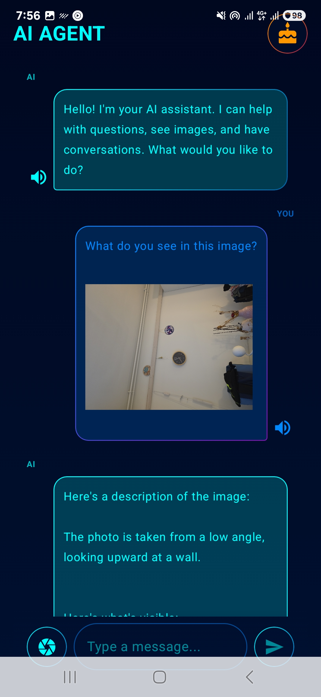
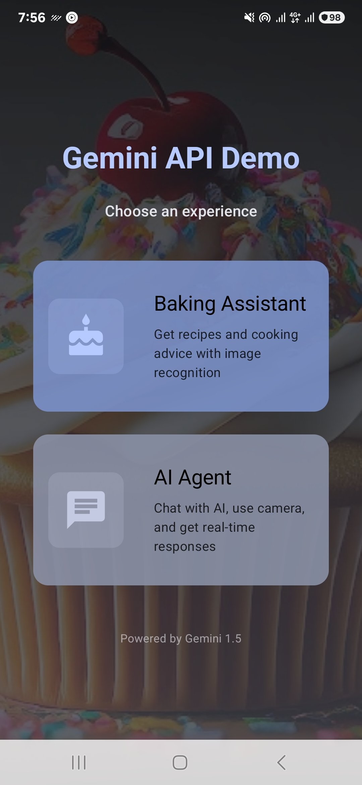
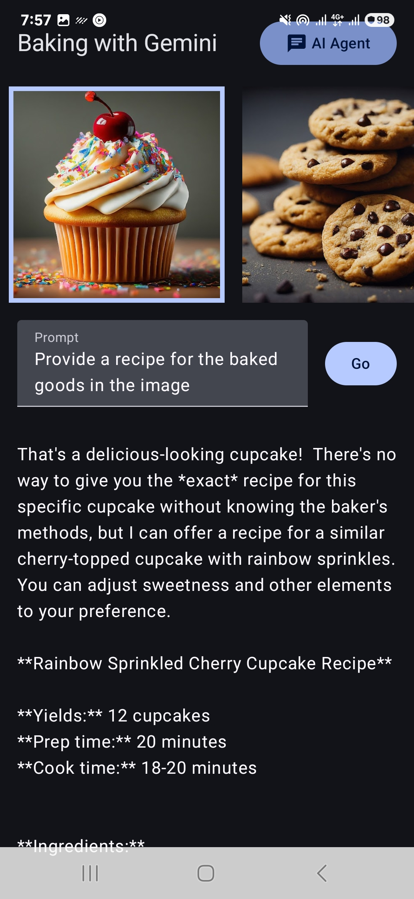
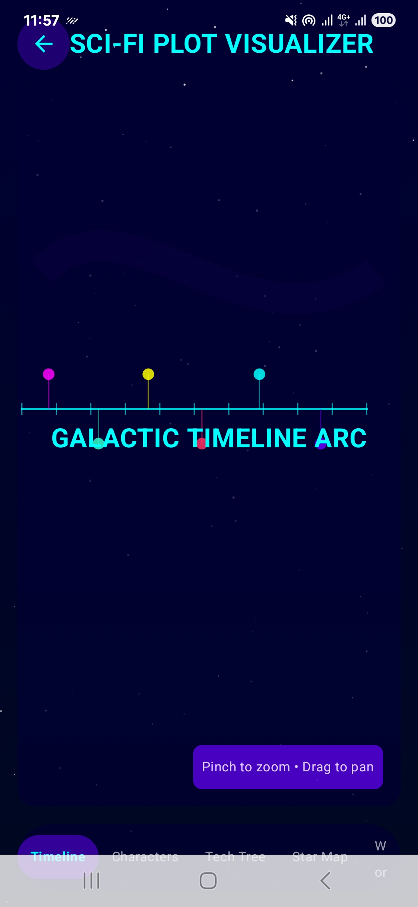
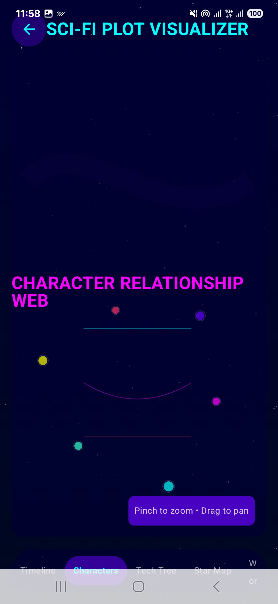
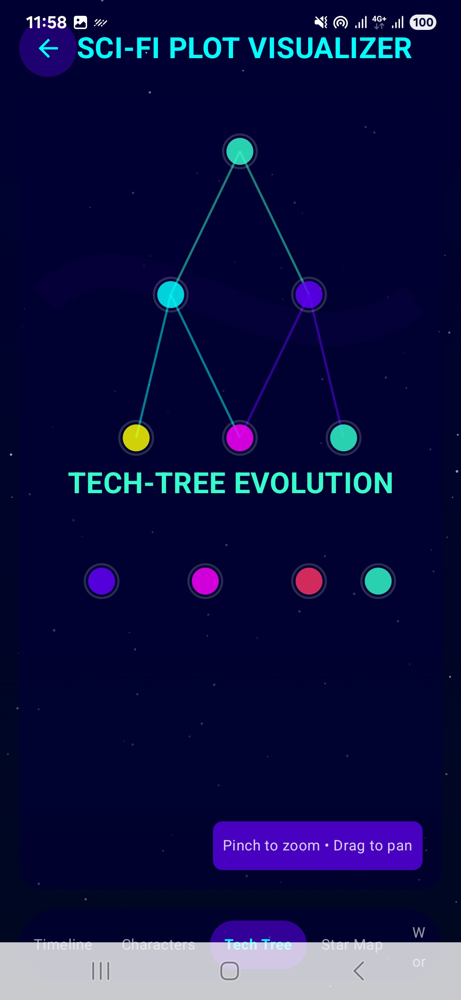
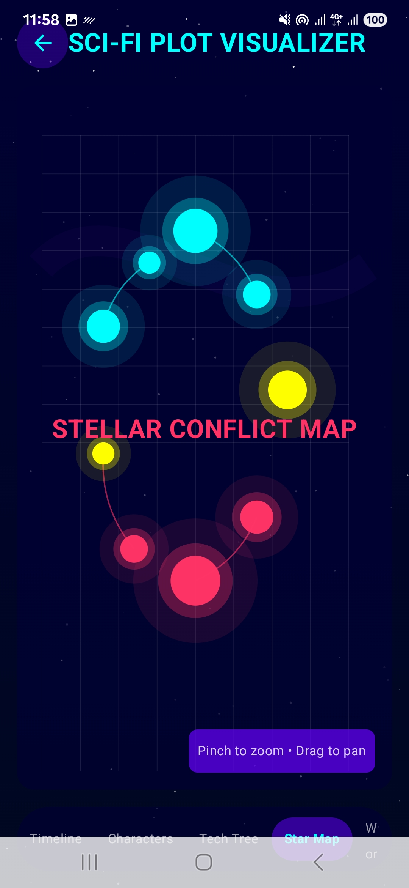
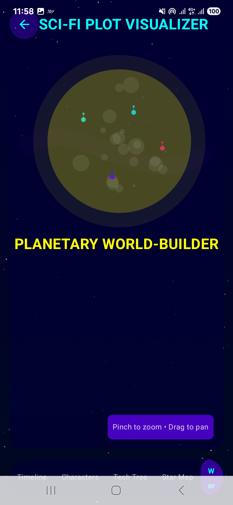

# GeminiAPI Android Application

A cutting-edge Android application showcasing Google's Gemini AI capabilities with a holographic user interface.

## Features

### AI Agent Screen
- Real-time conversational AI interface
- Camera integration for image analysis
- Text-to-Speech (TTS) functionality
- Holographic sci-fi user interface
- Image capture and processing

### Baking Assistant
- Image-based recipe suggestions
- Multimodal AI interactions
- Visual food recognition

### SciFi Plot Visualization
- Six interactive visualization types
- Holographic, animated UI elements
- Canvas-based custom drawings
- Dynamic scaling and transformation
- Sci-fi themed color palette

## Technical Components

- **Language**: Kotlin
- **UI Framework**: Jetpack Compose
- **AI Integration**: Gemini API
- **Camera**: CameraX
- **Text-to-Speech**: Android TTS
- **State Management**: Kotlin Coroutines, StateFlow

## UI Design

The application features a futuristic holographic design with:
- Cyan/blue color scheme
- Animated, borderless components
- Responsive design with dynamic interactions

## Setup

1. Clone the repository
2. Add your Gemini API key in the secrets.properties file
3. Build and run the application

## Requirements

- Android Studio Iguana or newer
- Android SDK 34+
- Gemini API key

## Screenshots

  
  
  

### SciFi Plot Visualization Screens

  
  
  

  
  

## License

This project is licensed under the MIT License - see the LICENSE file for details.
